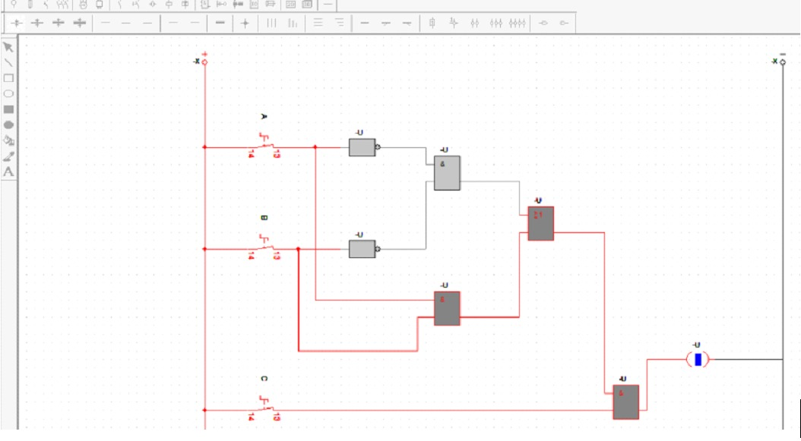
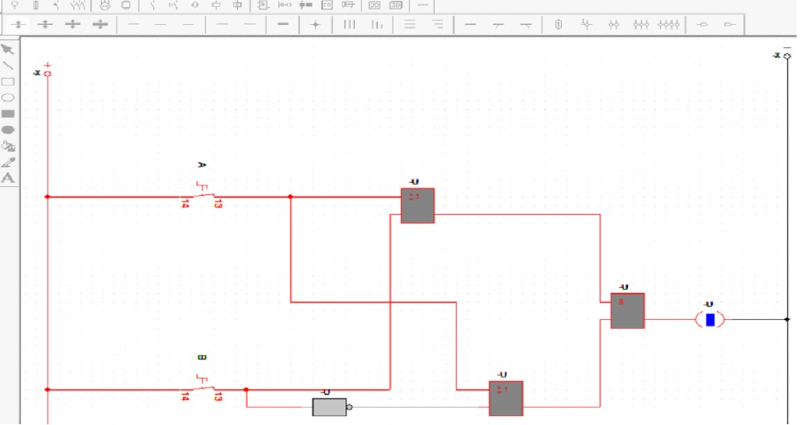
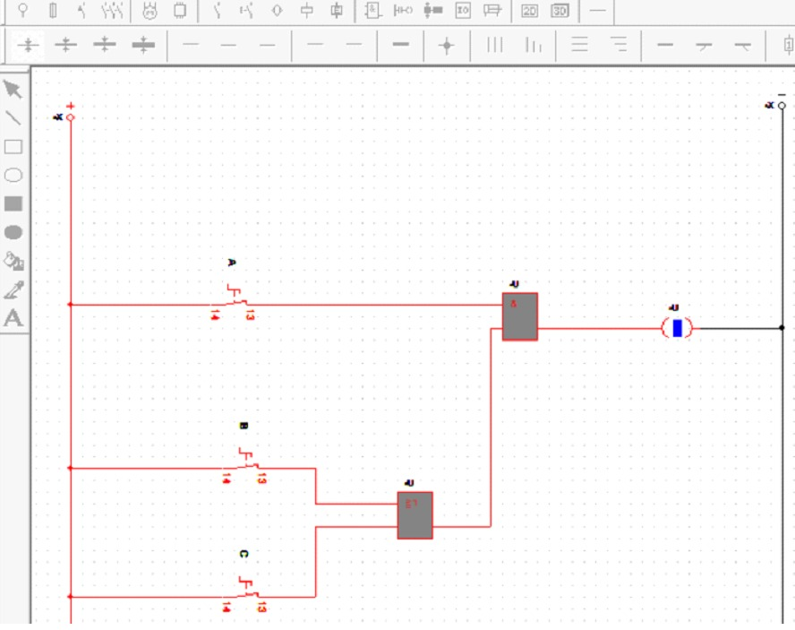
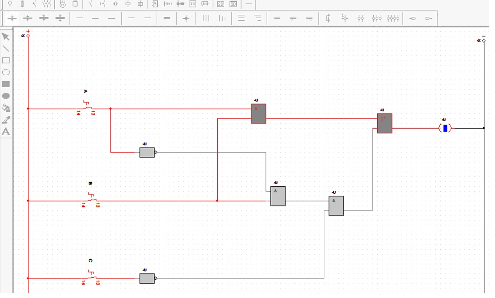

## Simulación de Circuitos de Control Eléctrico en CADESIMU

### 1. OBJETIVO
Simular 4 circuitos de control eléctrico en el software CADESIMU utilizando pulsadores, contactos NA/NC y relés. Analizar su funcionamiento lógico mediante tablas de verdad.

### 2. SOFTWARE UTILIZADO
**CADESIMU** - Software de simulación de esquemas eléctricos y automatismos.  
Versión utilizada: [Pon la versión si la sabes]

### 3. DESARROLLO DE PRÁCTICAS EN CADESIMU

#### 3.1 PRÁCTICA 1: Función Lógica AND

**Descripción CADESIMU**: Circuito con 3 pulsadores A, B, C. Se utilizaron relés 1U, 2U, 3U, 4U.  
**Funcionamiento**: La bobina 4U se energiza solo cuando A AND B AND C están activos simultáneamente.  
**Ecuación**: `S = A · B · C`

#### 3.2 PRÁCTICA 2: Función Lógica OR con Prioridad

**Descripción CADESIMU**: Circuito con 2 pulsadores A, B y 3 relés. Se usó un contacto NC para dar prioridad.  
**Funcionamiento**: La salida se activa con A OR B. Si A está activo bloquea a B mediante el NC.  
**Ecuación**: `S = A + (B · A')`

#### 3.3 PRÁCTICA 3: Circuito con Enclavamiento

**Descripción CADESIMU**: Circuito con 3 pulsadores. Se implementó enclavamiento con el contacto auxiliar de 4U.  
**Funcionamiento**: Al pulsar A se enclava y mantiene la salida. B y C trabajan en serie con condiciones de bloqueo.  
**Ecuación**: `S = A + (B · C)`

#### 3.4 PRÁCTICA 4: Circuito Básico Paralelo

**Descripción CADESIMU**: Circuito básico con 2 pulsadores en paralelo.  
**Funcionamiento**: La salida se activa con A OR B. Demuestra control desde 2 puntos distintos.  
**Ecuación**: `S = A + B`

### 4. TABLAS DE VERDAD
Se verificó cada combinación en CADESIMU y se comprobó que el comportamiento coincide con la teoría de álgebra de Boole.

### 5. CONCLUSIONES
1.  CADESIMU permite simular circuitos de control sin riesgo de cortocircuitos.
2.  Se comprobó en la simulación el uso de contactos NA, NC y enclavamientos.
3.  El software facilita entender la lógica de relés antes de llevarlo a tableros reales.
4.  Todas las prácticas fueron validadas y funcionan correctamente en CADESIMU.
