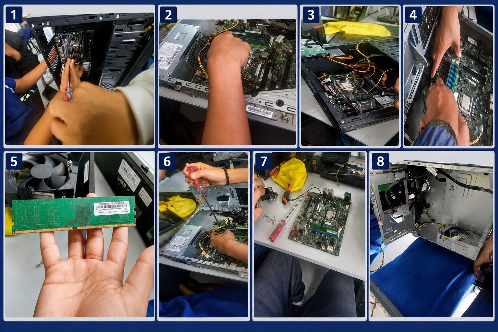
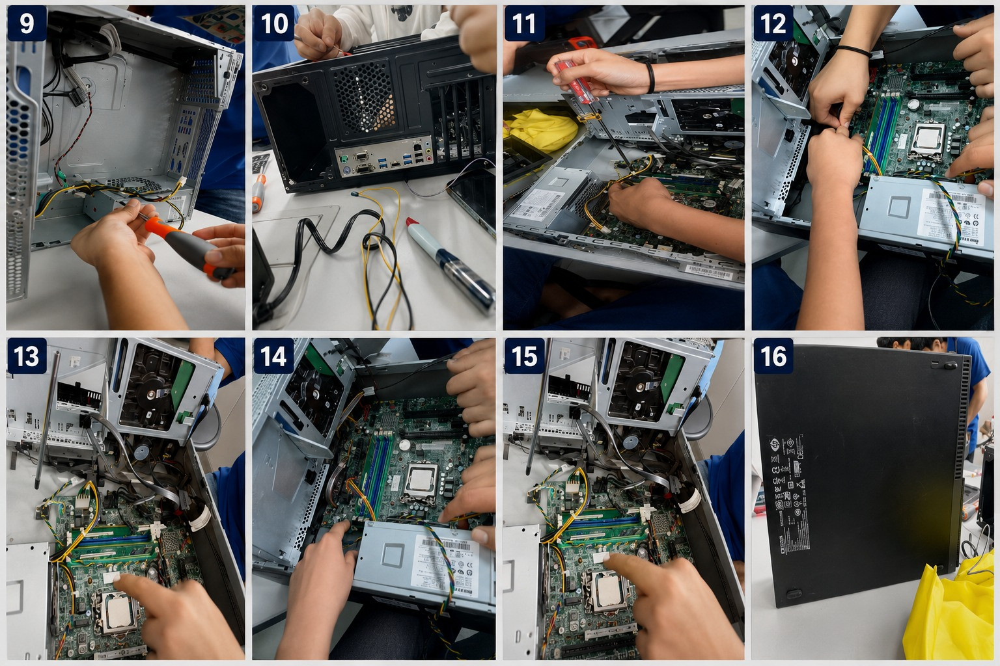

# LAB 04: ARMADO Y DESARMADO DE UN PC 💻⚡

## 📌 Descripción
En este laboratorio pusimos manos a la obra: desarmamos y armamos una PC de escritorio desde cero. 
Identificamos cada componente, aplicamos normas de seguridad y aprendimos el orden correcto para 
no malograr nada.

## 🎯 Objetivo
1.  **Desarmar** una computadora de forma segura y ordenada
2.  **Identificar** todos los componentes internos y su función  
3.  **Armar** nuevamente la PC verificando que todo funcione

## 🛠️ Materiales y Herramientas
| **Destornilladores** | Quitar y poner tornillos del gabinete |
| **Pulsera antiestática** | Proteger componentes de descargas eléctricas |
| **Brocha** | Limpiar polvo del interior |
| **Tornillos** | Fijar placa madre, discos y fuente |

## 🔧 PROCESO DE DESARMADO

### Collage: Proceso Completo de Desarmado

**Secuencia:** Preparación → Retiro de Tapa → Desconexión → Componentes → RAM → Desmontaje → Placa Madre  → Gabinete Vacío

## 🔩 PROCESO DE ARMADO

### Collage: Proceso Completo de Armado

**Secuencia:** Inicio → Placa Madre → Componentes → Discos → Cables → Verificación → Orden → Cierre Final

## ⚠️ Normas de Seguridad Aplicadas
- ✅ **Desconectar todo** antes de tocar
- ✅ **Pulsera antiestática** puesta siempre
- ✅ **No tocar contactos** dorados de RAM y procesador
- ✅ **Revisión final** antes de encender

## ✅ Resultado
Armado y desarmado exitoso. La PC encendió correctamente después del proceso.

## 🎓 Conclusión
Este laboratorio fue clave para entender cómo funciona una PC por dentro. 
Aprendí que el orden y la paciencia son más importantes que la velocidad.

